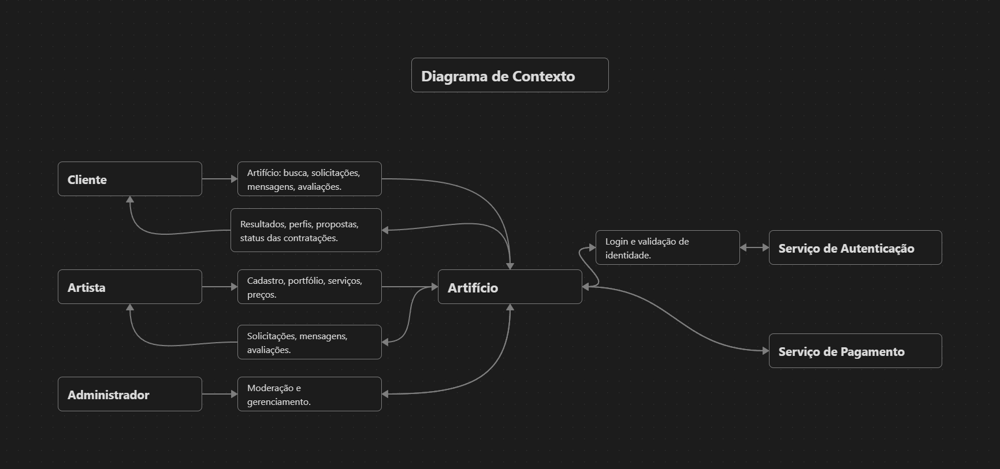
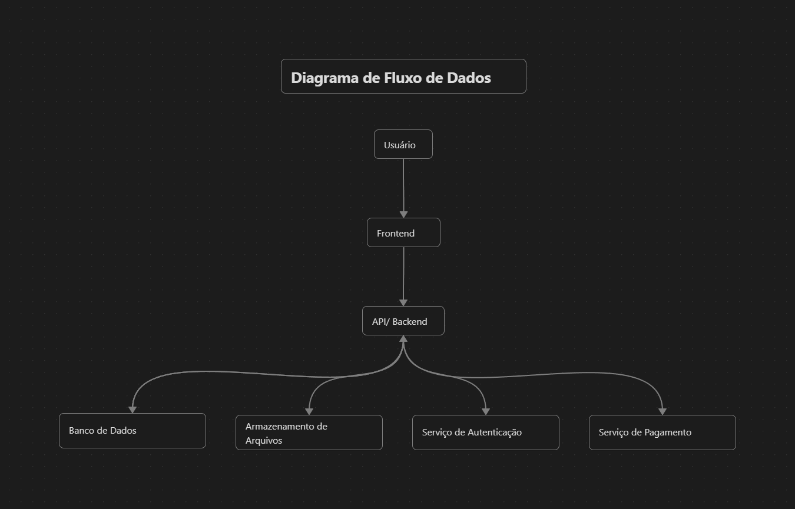
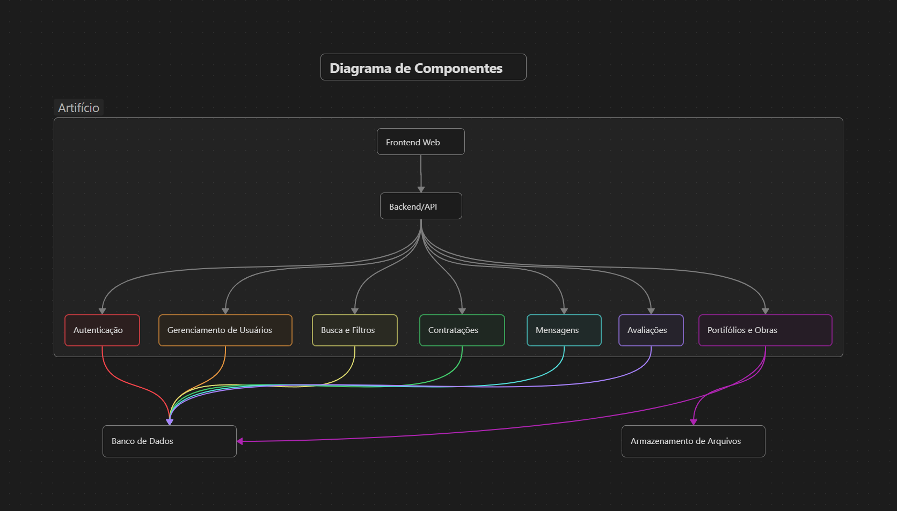
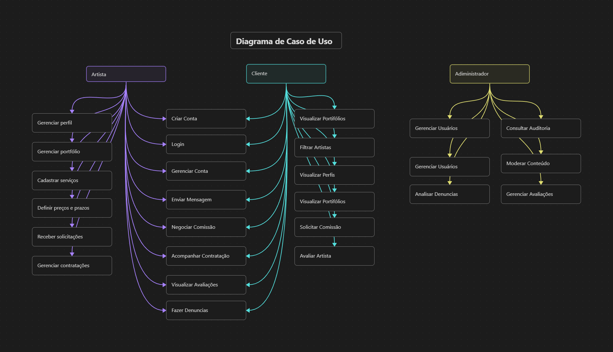
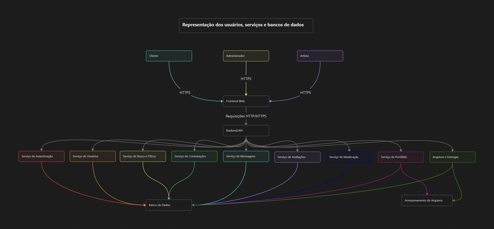

### 8.1 Identificação do sistema
Nome do sistema: Artifício

Integrantes do grupo: Anna Letycia Fernandes Reis, Cristiano Silveira Silva, Eduardo Nascimento de Souza Rolim, Luan Diniz Mazaro Rodovalho

Endereço do repositório: https://github.com/cristianowa1150/Trabalho_final_eng_soft_seguro

Breve justificativa para a escolha do sistema: O tema foi escolhido devido ao potencial do **Artifício** de ser uma plataforma útil para o meio comercial artístico, facilitando a conexão entre artistas e clientes interessados em contratar serviços e obras personalizadas.  
Além disso, o sistema apresenta diversos elementos relevantes para o estudo de segurança de software, como autenticação de usuários, controle de acesso, dados pessoais, mensagens privadas, arquivos enviados, avaliações, contratações e possíveis informações financeiras. 
Dessa forma, o desenvolvimento do Artifício permite aplicar, de maneira prática, os conceitos e técnicas de segurança abordados na disciplina, especialmente na identificação, análise e mitigação de ameaças.

### 8.2 Descrição do sistema

O Artifício é uma plataforma web voltada à divulgação e contratação de serviços artísticos, funcionando como um catálogo de artistas e suas respectivas comissões.
O sistema busca facilitar a conexão entre pessoas interessadas em contratar uma obra personalizada e artistas que oferecem esse tipo de serviço, permitindo que o cliente encontre profissionais de acordo com suas necessidades e preferências.

Os principais usuários do sistema são clientes, artistas e administradores. Os clientes podem pesquisar artistas por meio de uma busca facetada, utilizando categorias e filtros como tipo de arte, estilo, faixa de preço, prazo de entrega e outras características. 
Após encontrar um artista, o cliente pode visualizar seu perfil e portfólio, consultar os serviços oferecidos e realizar uma solicitação de comissão.
Os artistas podem criar e gerenciar seus próprios perfis, cadastrar informações sobre os serviços oferecidos, publicar obras em seus portfólios, definir preços-base, prazos e condições de trabalho e gerenciar as solicitações recebidas. 
A plataforma também deve permitir a comunicação entre cliente e artista para negociação das condições da comissão, mantendo o histórico das interações relacionadas à contratação.

O sistema também possui funcionalidades administrativas destinadas à moderação da plataforma, gerenciamento de usuários, tratamento de denúncias e resolução de eventuais conflitos.
Entre as principais informações armazenadas estão os dados cadastrais dos usuários, credenciais de autenticação, informações dos perfis de artistas, imagens e demais arquivos dos portfólios, categorias e tags, preços e prazos dos serviços, solicitações de contratação, propostas, mensagens, avaliações e
registros de atividades. Dependendo da forma de pagamento adotada pela plataforma, também poderão existir informações relacionadas aos pagamentos e repasses financeiros.
Parte dessas informações é destinada à divulgação pública, como nome de exibição, descrição do artista, portfólio, categorias, tags, preços e prazos definidos para os serviços. Outras informações possuem caráter privado e devem ser acessíveis somente aos usuários autorizados, como credenciais, e-mails,
mensagens, dados de contratação, informações financeiras e registros administrativos.

Dessa forma, os principais recursos que precisam ser protegidos são as contas dos usuários, os dados pessoais, as credenciais de autenticação, os portfólios e arquivos enviados, as mensagens e negociações, os registros de contratação e avaliação, as informações financeiras e os recursos administrativos da plataforma. A proteção desses recursos deve garantir principalmente **confidencialidade, integridade e disponibilidade**, evitando acesso não autorizado, alterações indevidas, perda de informações ou indisponibilidade do serviço.

### 8.3 Usuários, ativos e pontos de interação

Os principais usuários e elementos envolvidos no sistema são:

| Elemento | Descrição | Ativo importante? |
|---|---|---|
| **Cliente** | Usuário que pesquisa artistas, visualiza portfólios, solicita comissões e acompanha suas contratações. | Sim |
| **Artista** | Usuário que oferece serviços artísticos, gerencia seu perfil, portfólio, preços e solicitações. | Sim |
| **Administrador** | Responsável pela administração, moderação, tratamento de denúncias e gerenciamento da plataforma. | Sim |
| **Conta de usuário** | Contém informações de identificação, configurações e permissões de cada usuário. | Sim |
| **Credenciais** | Senhas, tokens de sessão e demais mecanismos utilizados para autenticação. | Sim |
| **Perfil do artista** | Informações públicas e configurações utilizadas para apresentar o artista na plataforma. | Sim |
| **Portfólio e obras** | Imagens e outros arquivos publicados pelos artistas para apresentar seus trabalhos. | Sim |
| **Solicitações e contratações** | Dados relacionados aos pedidos de comissão, propostas, preços, prazos e condições acordadas. | Sim |
| **Mensagens** | Comunicação privada entre clientes e artistas durante negociações e contratações. | Sim |
| **Avaliações** | Registros da experiência dos usuários após uma contratação, utilizados na reputação dos artistas. | Sim |
| **Dados financeiros** | Informações relacionadas a pagamentos. | Sim |
| **Logs e registros de auditoria** | Registros de ações relevantes realizadas no sistema, utilizados para segurança e investigação de incidentes. | Sim |
| **Banco de dados** | Armazena as informações de usuários, obras, contratações, mensagens, avaliações e demais dados da aplicação. | Sim |
| **Servidor da aplicação** | Executa as funcionalidades do sistema e processa as requisições dos usuários. | Sim |
| **Armazenamento de arquivos** | Responsável por armazenar imagens e demais arquivos enviados pelos usuários. | Sim |
| **APIs** | Interfaces utilizadas para comunicação entre o frontend, backend e possíveis serviços externos. | Sim |
| **Serviços externos** | Serviços utilizados para funcionalidades como autenticação, pagamentos, hospedagem, aramazenamento. | Sim |

Os principais pontos de interação do sistema são o navegador utilizado pelo cliente ou artista, a aplicação web, as APIs do backend, o banco de dados, o armazenamento de arquivos e eventuais serviços externos. O fluxo básico ocorre quando o usuário acessa a plataforma pelo navegador, 
realiza uma operação por meio da interface, e a aplicação processa a requisição, consulta ou altera os dados necessários e retorna o resultado ao usuário.

Entre os ativos, destacam-se as credenciais e sessões de usuários, pois seu comprometimento pode permitir acesso indevido às contas; os dados pessoais e financeiros,
devido ao risco de exposição ou uso indevido; as obras e portfólios, devido ao risco de adulteração, exclusão ou acesso não autorizado; as mensagens, propostas e contratações,
devido à necessidade de preservar sua confidencialidade e integridade; e os registros de auditoria, importantes para investigar incidentes e disputas.

O banco de dados, servidor, armazenamento de arquivos e APIs também são ativos críticos, pois sua indisponibilidade ou comprometimento pode afetar diversos usuários simultaneamente.
Da mesma forma, serviços externos utilizados para autenticação ou pagamentos representam pontos de dependência que devem ser considerados na análise de segurança.

### 8.4 Visão geral da arquitetura ou fluxo

