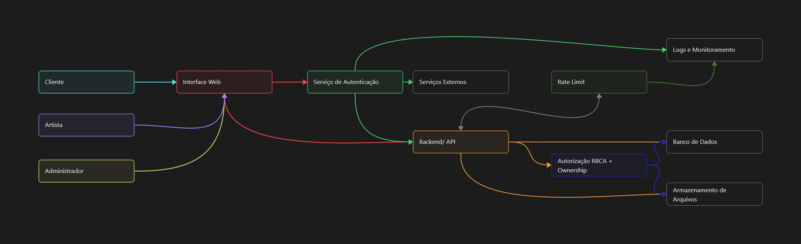

## 18.1 Componentes da arquitetura

A arquitetura da plataforma Artifício foi projetada com uma abordagem orientada a serviços e separação rigorosa de responsabilidades, garantindo que o processamento sensível e o controlo de acessos ocorram exclusivamente em ambientes controlados. Com base no Diagrama de Componentes e no Diagrama de Contexto, a solução é composta por:

* **Frontend Web (Interface Web):** Aplicação de face pública que providencia a interface de utilizador para Clientes, Artistas e Administradores. A sua função é estritamente de apresentação e captação de *inputs*. Não possui lógica de segurança fiável nem validação final de regras de negócio, funcionando sob o princípio de desconfiança (*Zero Trust*) do lado do cliente.
* **Backend / API (Núcleo de Processamento):** Serviço central responsável por processar todas as requisições HTTP/HTTPS recebidas do *Frontend*. Contém a lógica de negócio do sistema e atua como o ponto único de acesso aos recursos de dados, assegurando que operações de busca, filtragem, contratação e mensagens sejam validadas e estruturadas antes de qualquer execução.
* **Módulo de Autorização (RBAC + Ownership):** Acoplado ao Backend, é o componente que interceta as requisições para validar permissões de forma centralizada. Avalia tanto o papel administrativo ou comum do utilizador (RBAC) como a propriedade sobre o recurso pedido (ex: apenas o autor ou contratante pode ver ficheiros privados de uma comissão).
* **Serviço de Autenticação e Rate Limiting:** Responsável pela identificação rigorosa dos utilizadores e gestão das sessões. Integra uma camada de limitação de taxa (*Rate Limiting*) para proteger a plataforma contra ataques automatizados (força bruta de *login* ou sobrecarga de pesquisas e *uploads*).
* **Banco de Dados:** Repositório central (isolado da exposição pública) que armazena registos de utilizadores, dados de perfil, metadados de obras, histórico de comissões, avaliações, mensagens transacionais e registos de auditoria (*logs*). O acesso ao banco é estritamente mediado pela API do Backend.
* **Armazenamento de Arquivos (*Storage*):** Serviço dedicado para persistência de ficheiros pesados (imagens, portfólios, anexos de referência). Isola o armazenamento estático do servidor de aplicação principal, impedindo que ficheiros com intenções maliciosas afetem o processamento de código.
* **Serviços Externos:** Módulos de terceiros delegados para tarefas críticas que exigem alta conformidade, como processamento de pagamentos ou integração de identidade (ex: *logins* via OAuth), transferindo riscos transacionais diretos da infraestrutura do Artifício.

## 18.2 Requisitos de segurança na arquitetura

A estruturação dos componentes apresentada na seção anterior responde diretamente aos Requisitos Não Funcionais (RNF) de Segurança mapeados na modelagem inicial do sistema. A arquitetura mitiga as vulnerabilidades (STRIDE) aplicando camadas de defesa em profundidade:

| **ID do Requisito** | **Descrição** | **Mapeamento e Tratamento na Arquitetura** |
| --- | --- | --- |
| **RNF01** | O sistema deve garantir autenticação segura dos usuários. | Cumprido pelo **Serviço de Autenticação**. Este módulo concentra os fluxos de validade de identidade, emitindo *tokens* seguros, gerindo sessões com tempo limite e aplicando *Rate Limiting* contra tentativas de compromisso de conta (Risco R01). |
| **RNF02** | As senhas dos usuários devem ser armazenadas de forma segura. | Delegado e garantido na camada do **Banco de Dados**, acoplado ao **Serviço de Autenticação**, assegurando processos robustos de transformação criptográfica (*hashing* moderno) de modo a que nem mesmo incidentes de extração massiva (Risco R18) exponham credenciais planas. |
| **RNF03** | O sistema deve controlar o acesso às funcionalidades de acordo com o tipo de usuário. | Resolvido estruturalmente pelo **Módulo de Autorização (RBAC + Ownership)** no **Backend**. Impede a manipulação de parâmetros pela interface para elevação de privilégios (R29) ou acesso direto a rotas administrativas e ficheiros privados de terceiros (R28 e R30). |
| **RNF04** | A comunicação entre cliente e servidor deve utilizar HTTPS. | Implementado nas fronteiras da **Interface Web** e na **API**. A encriptação TLS garante confidencialidade em trânsito, impedindo a interceção de dados de contratação e sessões (Risco R35), sendo requisito obrigatório na comunicação entre os módulos e os **Serviços Externos**. |
| **RNF05** | O sistema deve proteger os dados dos usuários contra acessos não autorizados. | Garantido pela separação entre o **Backend** e o **Armazenamento de Arquivos / Banco de Dados**. Nenhuma consulta ou descarregamento (*download*) é público por predefinição. Funcionalidades como pesquisas em catálogos aplicam filtros para não expor metadados ou comunicações privadas (Mitigação do Risco R36 e R16). |

## 18.3 Diagrama da arquitetura segura



- Serviço de Autenticação: identifica o usuário e mantém o controle da sessão.
- Rate Limiting: limita tentativas excessivas de autenticação e outras operações suscetíveis a automação.
- Autorização (RBAC + Ownership): verifica tanto o papel do usuário quanto sua permissão sobre o recurso específico.
- Banco de Dados: armazena contas, perfis, obras, contratações, mensagens e demais informações. (Decidir qual usar - firebase?)
- Armazenamento de Arquivos: mantém obras, referências e arquivos relacionados às comissões.
- Logs e Monitoramento: registram operações relevantes para detecção e investigação de incidentes.
- Serviços Externos: representam serviços como autenticação externa, caso sejam utilizados. (Temos de decidir quais usar, provavelmente google)

## 18.4 Decisões de arquitetura

### Decisão 1 — Autorização centralizada no backend

| **Decisão** | **Risco tratado** | **Justificativa** | **Componente afetado** | **Resultado esperado** |
| :--- | :--- | :--- | :--- | :--- |
| Validar permissões no backend em todas as operações protegidas, utilizando o papel do usuário e as regras de acesso ao recurso. | **R28, R30** | A interface pode ser manipulada pelo usuário e não deve ser considerada uma barreira de segurança. A validação no servidor impede que um usuário acesse diretamente endpoints administrativos ou recursos pertencentes a outros usuários. | Backend/API e banco de dados | Impedir acesso não autorizado a funções administrativas e aos recursos de outros usuários. |

A autorização será realizada no backend antes da execução das operações protegidas. Para isso, serão considerados tanto o **papel do usuário** quanto as regras de **propriedade ou autorização sobre o recurso**.

```text
Usuário → API → Autorização
                  ├── Possui o papel necessário?
                  └── Possui autorização sobre o recurso?
                         ↓
                  Permitir / Recusar
```

### Decisão 2 — Controle de acesso aos arquivos baseado em autorização

| **Decisão** | **Risco tratado** | **Justificativa** | **Componente afetado** | **Resultado esperado** |
| :--- | :--- | :--- | :--- | :--- |
| O acesso a obras, referências e arquivos de comissões deverá passar pelo backend, que verificará a propriedade ou autorização do usuário antes de liberar o arquivo. | **R30** | Links ou identificadores de arquivos não devem representar autorização por si mesmos. A validação no backend reduz o risco de um usuário descobrir o identificador de uma obra ou arquivo e acessá-lo diretamente. | Backend/API e armazenamento de arquivos | Impedir acesso direto a arquivos privados de outros usuários. |

O armazenamento de arquivos deverá diferenciar os arquivos públicos dos arquivos privados relacionados às comissões. As obras publicadas no portfólio podem ser disponibilizadas publicamente, enquanto arquivos de referência e entregas de uma comissão devem possuir acesso restrito aos usuários envolvidos na contratação.

A solicitação de um arquivo privado deverá seguir o fluxo:

```text
Usuário → Backend/API → Autorização
                           ↓
                  Verificar propriedade
                  ou permissão de acesso
                           ↓
                    Permitir / Recusar
                           ↓
                  Armazenamento de arquivos
```

### Decisão 3 — Rate limiting no serviço de autenticação

| **Decisão** | **Risco tratado** | **Justificativa** | **Componente afetado** | **Resultado esperado** |
| :--- | :--- | :--- | :--- | :--- |
| Aplicar rate limiting às operações de login e recuperação de conta, considerando critérios como conta e origem da requisição, com registro das tentativas excedentes. | **R21** | Operações de autenticação podem ser exploradas por bots para gerar grande quantidade de requisições ou tentar comprometer contas. O controle reduz a capacidade de automação e limita o impacto sobre o serviço. | Serviço de autenticação, API e monitoramento | Reduzir ataques automatizados e evitar que tentativas excessivas comprometam a disponibilidade do serviço. |

O serviço de autenticação deverá limitar a quantidade de requisições realizadas em um determinado intervalo de tempo. Quando o limite for excedido, novas requisições poderão ser temporariamente bloqueadas ou retardadas.

O fluxo simplificado será:

Usuário → Serviço de Autenticação → Rate Limiting

Dentro do limite:
- Processar autenticação;
- Registrar a operação nos logs.

Limite excedido:
- Bloquear ou retardar a requisição;
- Registrar a tentativa nos logs;
- Permitir o monitoramento de possíveis comportamentos automatizados.

Além de limitar as requisições, as tentativas excedentes deverão ser registradas para permitir o monitoramento de possíveis comportamentos automatizados ou ataques.

Essa decisão trata diretamente o risco **R21 – Sobrecarga por login ou recuperação automatizada**, reduzindo tanto a possibilidade de abuso do serviço quanto o impacto de grandes quantidades de requisições sobre o serviço de autenticação.
